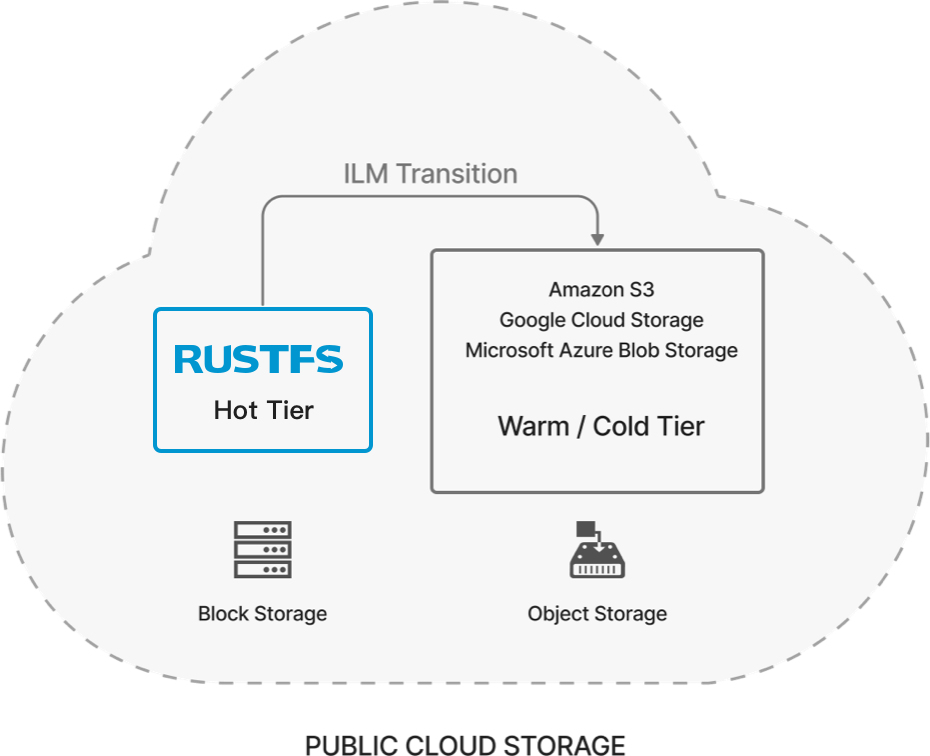

# Data Lifecycle Management and Tiering

As data continues to grow, the ability to collaboratively optimize for access, security, and economics becomes a hard requirement rather than a nice-to-have. This is where lifecycle data management comes into play. RustFS provides a unique set of features to protect data within and between clouds - including public and private clouds. RustFS's enterprise data lifecycle management tools, including versioning, object locking, and various derivative components, satisfy many use cases.

## Object Expiration

Data doesn't have to exist forever: RustFS lifecycle management tools allow you to define how long data remains on disk before deletion. Users define the time length as a specific date or number of days before RustFS begins deleting objects.

Lifecycle management rules are created per bucket and can be constructed using any combination of object and tag filters. Don't specify filters to set expiration rules for the entire bucket, or specify multiple rules to create more complex expiration behavior.

RustFS object expiration rules also apply to versioned buckets and come with some versioning-specific flavors. For example, you can specify expiration rules only for non-current versions of objects to maximize the benefits of object versioning without incurring long-term storage costs. Similarly, you can create lifecycle management rules for deleting objects whose only remaining version is a delete marker.

Bucket expiration rules fully comply with RustFS WORM locking and legal holds - objects in a locked state will remain on disk until the lock expires or is explicitly released. Once objects are no longer constrained by locks, RustFS begins applying expiration rules normally.

RustFS object expiration lifecycle management rules are functionally and syntactically compatible with AWS Lifecycle Management. RustFS also supports importing existing rules in JSON format, making it easy to migrate existing AWS expiration rules.

## Policy-Based Object Tiering

RustFS can be programmatically configured for object storage tiering so that objects transition from one state or class to another based on any number of variables - though the most commonly used are time and frequency of access. This feature is best understood in the context of tiering. Tiering allows users to optimize storage costs or functionality in response to changing data access patterns. Tiered data storage is generally used in the following scenarios:

## Across Storage Media

Cross-storage media tiering is the most well-known and straightforward tiering use case. Here, RustFS abstracts the underlying media and collaboratively optimizes for performance and cost. For example, for performance or nearline workloads, data might be stored on NVMe or SSD, but after a period of time, tiered to HDD media, or for workloads that value performance scaling. Over time, if appropriate, this data can be further migrated to long-term storage.

## Across Cloud Types

A rapidly emerging use case involves using public cloud's cheap storage and compute resources as another tier for private clouds. In this use case, performance-oriented nearline workloads are executed using appropriate private cloud media. Data volume doesn't matter, but value and performance expectations do. As data volumes increase and performance expectations decrease, enterprises can use public cloud's cold storage options to optimize costs and access capabilities associated with retaining data.

This is achieved by running RustFS on both private and public clouds. Using replication, RustFS can move data to cheap public cloud options and use RustFS in the public cloud to protect and access it when necessary. In this case, the public cloud becomes dumb storage for RustFS, just as JBOD becomes dumb storage for RustFS. This approach avoids replacing and adding outdated tape infrastructure.

## In Public Clouds

RustFS typically serves as the primary application storage tier in public clouds. In this case, as with other use cases, RustFS is the only storage accessed by applications. Applications (and developers) don't need to know anything beyond the storage endpoint. RustFS determines which data belongs where based on management parameters. For example, RustFS can determine that block data should move to the object tier, and which object tier meets the enterprise's performance and economic goals.

RustFS combines different storage tiering layers and determines appropriate media to provide better economics without compromising performance. Applications simply address objects through RustFS, while RustFS transparently applies policies to move objects between tiers and retains that object's metadata in the block tier.

