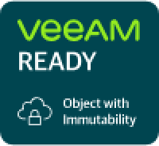

# Veeam Integration

RustFS provides comprehensive integration with Veeam Backup & Replication, delivering enterprise-grade backup and recovery solutions with superior performance and reliability.

## Overview



RustFS with Veeam offers:

- **High-Performance Backup**: Ultra-fast backup and restore operations
- **Object Storage Target**: S3-compatible object storage for Veeam repositories
- **Immutable Backups**: Ransomware protection with object lock
- **Cloud Integration**: Seamless integration with cloud and hybrid environments

## Key Advantages

### Backup Performance Excellence


#### Superior Throughput

- **Parallel Processing**: Massive parallel backup streams
- **Optimized I/O**: Optimized for backup workload patterns
- **Deduplication**: Inline deduplication reduces storage requirements
- **Compression**: Advanced compression algorithms

### Backup and Restore Efficiency


#### Fast Recovery

- **Instant Recovery**: Instant VM and file recovery
- **Granular Recovery**: File-level and application-level recovery
- **Cross-Platform**: Support for VMware, Hyper-V, and physical servers
- **Cloud Recovery**: Recovery to cloud environments

### Hardware Agnostic Architecture


#### Flexible Deployment

- **Any Hardware**: Deploy on commodity hardware
- **Cloud Deployment**: Deploy in public cloud environments
- **Hybrid Architecture**: Seamless hybrid deployment
- **Scale-Out Design**: Linear performance scaling

### Inline Consistency and Reliability


#### Data Integrity

- **Checksums**: End-to-end data integrity verification
- **Self-Healing**: Automatic detection and repair of data corruption
- **Versioning**: Multiple backup versions with retention policies
- **Compliance**: Meet regulatory compliance requirements

### Metadata Advantage


#### Intelligent Metadata

- **Fast Indexing**: Rapid backup catalog and indexing
- **Search Capabilities**: Advanced search and discovery
- **Reporting**: Comprehensive backup reporting
- **Analytics**: Backup analytics and insights

## Veeam Integration Features

### Object Storage Repository

#### S3-Compatible Interface

- **Native S3 API**: Full Amazon S3 API compatibility
- **Veeam SOBR**: Scale-Out Backup Repository integration
- **Capacity Tier**: Use as capacity tier for long-term retention
- **Archive Tier**: Integration with archive storage tiers

#### Immutable Storage

- **Object Lock**: WORM (Write Once, Read Many) compliance
- **Ransomware Protection**: Protection against ransomware attacks
- **Legal Hold**: Legal hold capabilities for compliance
- **Retention Policies**: Flexible retention and deletion policies

### Backup Repository Configuration

#### Repository Types

- **Primary Repository**: High-performance primary backup storage
- **Secondary Repository**: Secondary backup for 3-2-1 strategy
- **Archive Repository**: Long-term archive storage
- **Cloud Repository**: Cloud backup repository

#### Performance Optimization

- **Concurrent Tasks**: Support for multiple concurrent backup jobs
- **Block Size**: Optimized block sizes for backup workloads
- **Compression**: Hardware-accelerated compression
- **Encryption**: AES-256 encryption for backup data

## Deployment Architectures

### On-Premises Backup

```
┌─────────────────┐    ┌─────────────────┐
│   Production    │    │   Backup        │
│   Environment   │───►│   Repository    │
│                 │    │   (RustFS)      │
│ • VMs           │    │                 │
│ • Physical      │    │ • Fast Backup   │
│ • Applications  │    │ • Deduplication │
└─────────────────┘    └─────────────────┘
```

### Hybrid Backup Strategy

```
┌─────────────────┐    ┌─────────────────┐    ┌─────────────────┐
│   On-Premises   │    │   Local Backup  │    │   Cloud Backup  │
│   Production    │───►│   (RustFS)      │───►│   (RustFS)      │
│                 │    │                 │    │                 │
│ • Primary Data  │    │ • Fast Recovery │    │ • Long-term     │
│ • Applications  │    │ • Local Restore │    │ • DR Copy       │
└─────────────────┘    └─────────────────┘    └─────────────────┘
```

### Multi-Site Backup

```
┌─────────────────┐    ┌─────────────────┐
│   Site A        │    │   Site B        │
│   Production    │◄──►│   DR Site       │
│                 │    │                 │
│ ┌─────────────┐ │    │ ┌─────────────┐ │
│ │   Primary   │ │    │ │   Replica   │ │
│ │   Backup    │ │    │ │   Backup    │ │
│ │  (RustFS)   │ │    │ │  (RustFS)   │ │
│ └─────────────┘ │    │ └─────────────┘ │
└─────────────────┘    └─────────────────┘
```

## Configuration and Setup

### Veeam Repository Configuration

#### Adding RustFS as Backup Repository

```powershell
# PowerShell example for adding RustFS repository
Add-VBRBackupRepository -Name "RustFS-Repository" -Type ObjectStorage -S3Endpoint "https://rustfs.example.com" -AccessKey "your-access-key" -SecretKey "your-secret-key" -Bucket "veeam-backups"
```

#### Scale-Out Backup Repository (SOBR)

```powershell
# Create SOBR with RustFS
$extent = Get-VBRBackupRepository -Name "RustFS-Repository"
Add-VBRScaleOutBackupRepository -Name "SOBR-RustFS" -Extent $extent -Policy DataLocality
```

### Performance Tuning

#### Backup Job Optimization

- **Parallel Processing**: Configure optimal number of parallel tasks
- **Block Size**: Set appropriate block sizes for workloads
- **Compression Level**: Balance compression ratio vs. performance
- **Deduplication**: Enable global deduplication

#### Network Optimization

- **Bandwidth Throttling**: Configure bandwidth limits
- **Network Acceleration**: Use WAN acceleration when available
- **Encryption**: Configure transport encryption
- **Connection Pooling**: Optimize connection management

## Use Cases and Scenarios

### Virtual Machine Backup

#### VMware vSphere

- **vSphere Integration**: Native vSphere integration
- **Changed Block Tracking**: Incremental backup optimization
- **Application-Aware Processing**: Consistent application backups
- **Instant VM Recovery**: Fast VM recovery and failover

#### Microsoft Hyper-V

- **Hyper-V Integration**: Native Hyper-V integration
- **RCT Support**: Resilient Change Tracking
- **Live Migration**: Backup during live migration
- **Cluster Support**: Hyper-V cluster backup

### Physical Server Backup

#### Veeam Agent

- **File-Level Backup**: File and folder backup
- **Image-Level Backup**: Full system image backup
- **Bare Metal Recovery**: Complete system recovery
- **Granular Recovery**: Individual file recovery

#### Database Backup

- **SQL Server**: SQL Server backup and recovery
- **Oracle**: Oracle database backup
- **Exchange**: Microsoft Exchange backup
- **SharePoint**: SharePoint backup and recovery

### Cloud Backup

#### Cloud Connect

- **Service Provider**: Act as cloud backup service provider
- **Multi-Tenancy**: Support multiple customers
- **Bandwidth Control**: Manage bandwidth usage
- **Encryption**: End-to-end encryption

#### Hybrid Cloud

- **Cloud Tier**: Use cloud as capacity tier
- **Cloud Archive**: Long-term cloud archival
- **Cloud Recovery**: Disaster recovery to cloud
- **Cost Optimization**: Optimize cloud storage costs

## Security and Compliance

### Data Protection

#### Encryption

- **Encryption at Rest**: AES-256 encryption for stored data
- **Encryption in Transit**: TLS encryption for data transfer
- **Key Management**: Secure key management
- **Hardware Encryption**: Hardware-based encryption support

#### Immutable Backups

- **Object Lock**: Prevent backup deletion or modification
- **Compliance Mode**: Strict compliance mode
- **Governance Mode**: Flexible governance mode
- **Legal Hold**: Legal hold capabilities

### Compliance Features

#### Regulatory Compliance

- **GDPR**: General Data Protection Regulation compliance
- **HIPAA**: Healthcare data protection
- **SOX**: Sarbanes-Oxley compliance
- **PCI DSS**: Payment card industry standards

#### Audit and Reporting

- **Audit Logs**: Comprehensive audit logging
- **Compliance Reports**: Automated compliance reporting
- **Data Classification**: Automatic data classification
- **Retention Policies**: Flexible retention management

## Monitoring and Management

### Veeam Console Integration

#### Backup Monitoring

- **Job Status**: Real-time backup job monitoring
- **Performance Metrics**: Backup performance analytics
- **Capacity Planning**: Storage capacity planning
- **Health Monitoring**: System health monitoring

#### Alerting and Notifications

- **Email Alerts**: Email notification configuration
- **SNMP Traps**: SNMP monitoring integration
- **REST API**: RESTful API for integration
- **PowerShell**: PowerShell cmdlets for automation

### Third-Party Integration

#### Monitoring Tools

- **Veeam ONE**: Advanced monitoring and reporting
- **PRTG**: Network monitoring integration
- **SolarWinds**: Infrastructure monitoring
- **Nagios**: Open-source monitoring

#### Management Platforms

- **VMware vCenter**: vCenter plugin integration
- **Microsoft SCVMM**: System Center integration
- **PowerShell**: Automation and scripting
- **REST API**: Custom integration development

## Best Practices

### Backup Strategy

1. **3-2-1 Rule**: 3 copies, 2 different media, 1 offsite
2. **Regular Testing**: Regular backup and recovery testing
3. **Retention Policies**: Implement appropriate retention policies
4. **Monitoring**: Continuous monitoring and alerting

### Performance Optimization

1. **Sizing**: Proper sizing for backup workloads
2. **Network**: Optimize network configuration
3. **Scheduling**: Optimize backup scheduling
4. **Maintenance**: Regular maintenance and updates

### Security Best Practices

1. **Encryption**: Enable encryption for all backups
2. **Access Control**: Implement proper access controls
3. **Immutability**: Use immutable storage for critical backups
4. **Monitoring**: Monitor for security threats

## Troubleshooting

### Common Issues

#### Performance Issues

- **Slow Backups**: Optimize concurrent tasks and block sizes
- **Network Bottlenecks**: Check network bandwidth and latency
- **Storage Performance**: Monitor storage I/O performance
- **Resource Contention**: Monitor CPU and memory usage

#### Connectivity Issues

- **Network Connectivity**: Verify network connectivity
- **Firewall Rules**: Check firewall configuration
- **DNS Resolution**: Verify DNS resolution
- **Certificate Issues**: Check SSL certificate validity

#### Configuration Issues

- **Repository Configuration**: Verify repository settings
- **Credentials**: Check access credentials
- **Permissions**: Verify storage permissions
- **Backup Job Settings**: Review backup job configuration

## Getting Started

### Prerequisites

1. **Veeam Backup & Replication**: Version 10 or later
2. **RustFS Cluster**: Properly configured RustFS cluster
3. **Network Connectivity**: Network connectivity between Veeam and RustFS
4. **Credentials**: S3 access credentials for RustFS

### Quick Start Guide

1. **Configure RustFS**: Set up S3-compatible endpoint
2. **Add Repository**: Add RustFS as backup repository in Veeam
3. **Create Backup Job**: Create backup job using RustFS repository
4. **Test Backup**: Run test backup and verify success
5. **Configure Monitoring**: Set up monitoring and alerting
6. **Test Recovery**: Test backup recovery procedures

### Next Steps

- **Optimize Performance**: Tune backup job settings for optimal performance
- **Implement Security**: Configure encryption and immutable storage
- **Set Up Monitoring**: Implement comprehensive monitoring
- **Plan Disaster Recovery**: Develop disaster recovery procedures
- **Train Staff**: Train staff on backup and recovery procedures
